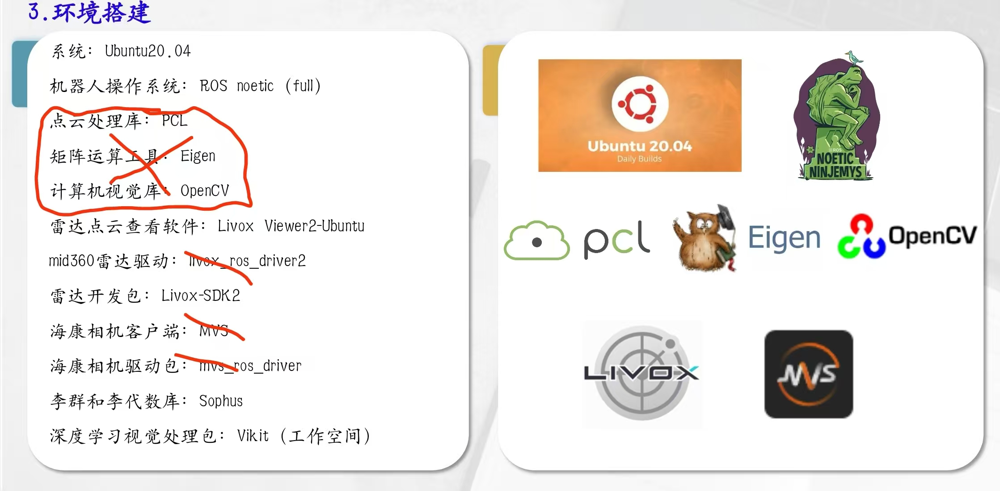

# FASTLIVO2 环境搭建日志

## 环境搭建



---

会遇到网络问题，针对20.04使用加速器

**网络加速工具下载：**
- [Clash Party Linux ARM64 1.8.8](source/clash-party-linux-1.8.8-arm64(1).deb)

直接使用 以下指令安装
```
sudo dpkg -i clash-party-linux-1.8.8-arm64(1).deb

```

该加速器基于Mihomo节点订阅
在其他电脑的浏览器拓展中安装‘无忧行’，购买会员后订阅节点后复制URL即可，理论上类似的节点架构也可以解析

上图中划×的不需要安装
核心为
###Sophus

```
git clone https://github.com/strasdat/Sophus.git

cd Sophus
git checkout a621ff
mkdir build && cd build && cmake ..
make
sudo make install

```
install时会出现报错解决方法如下

找到so2.cpp文件，修改如下
```

SO2::SO2()
{
  unit_complex_.real(1.);
  unit_complex_.imag(0.);
}

```

###Vikit的安装

``` 
cd catkin_ws/src //这里是ros的工作目录的src目录下

git clone https://github.com/xuankuzcr/rpg_vikit.git 

```
### 下载FAST-LIVO2代码与fast-calib到工作空间

```terminal
git clone https://github.com/hku-mars/FAST-Calib.git

git clone https://github.com/hku-mars/FAST-LIVO2.git


```


